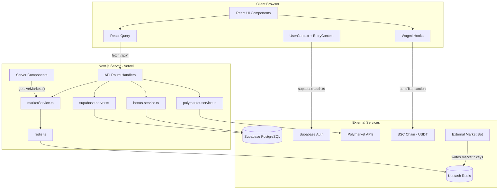
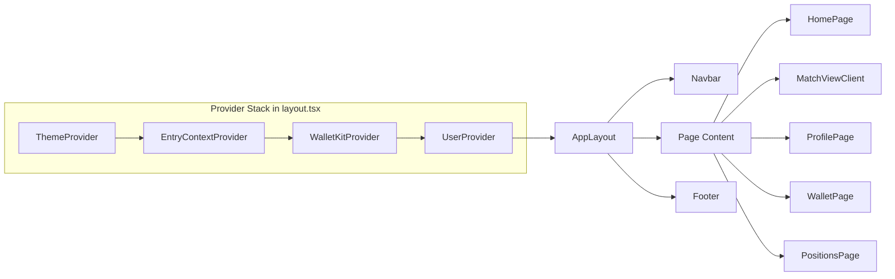
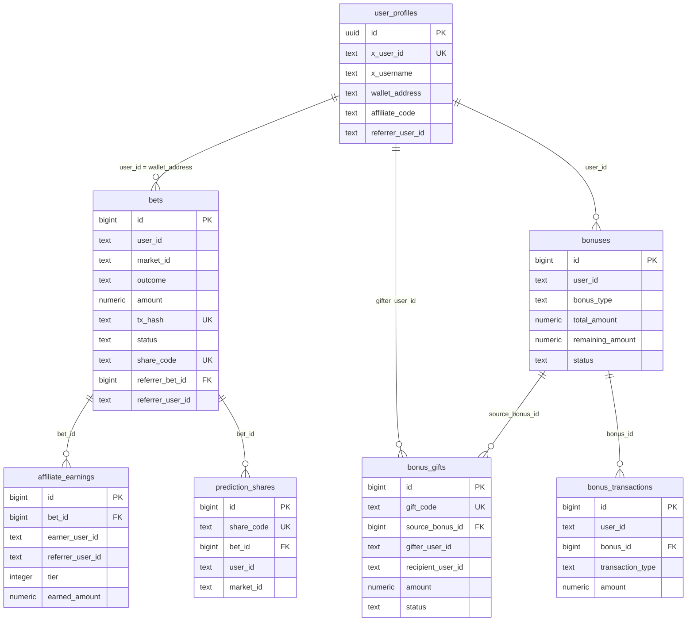
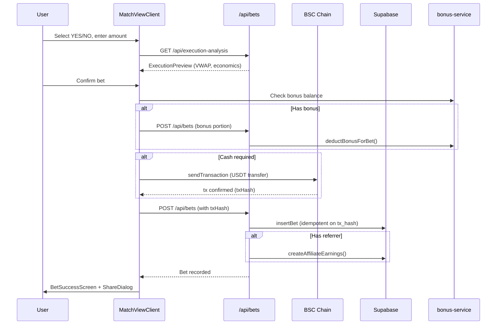

# WinBig - Full Architecture & Codebase Summary

## 1. Overview

WinBig is a prediction betting web application that acts as a **front-end interface to Polymarket**, allowing users to bet on binary-outcome prediction markets (YES/NO) using USDT on the BNB Smart Chain (BSC). The platform adds a 3% markup on Polymarket's order book prices, captures that margin as platform revenue, and distributes a portion to a two-tier affiliate referral system. Users connect their wallets (via Reown AppKit / WalletConnect) and optionally link an X (Twitter) account via Supabase OAuth. The platform also supports bonus/gift credits, social sharing via challenge links, and mirrored Polymarket user profiles.

**Core objectives:**

- Provide a simplified, mobile-friendly prediction betting UX powered by Polymarket liquidity
- Monetize via a transparent 3% spread markup on prices
- Drive growth through a two-tier affiliate program (Tier 1: 25%, Tier 2: 10% of platform fee)
- Enable social virality through challenge links, share codes, and OG image generation

**Main features:**

- Browse and bet on live prediction markets (data from Redis, sourced by an external bot)
- On-chain USDT transfers on BSC for bet placement
- X (Twitter) OAuth login and wallet-profile linking
- Two-tier affiliate referral and earnings tracking
- Bonus/gift credit system with volume-based unlock requirements
- Challenge/share links with dynamic OG images
- Polymarket profile mirroring and display
- Open positions tracking with live P&L
- Execution preview with orderbook-based VWAP simulation

## 2. Technology Stack

**Languages & Frameworks:**

- TypeScript (strict mode)
- Next.js 14.2.4 (App Router, React Server Components)
- React 18.3.1

**UI / Styling:**

- Tailwind CSS 3.4 + `tailwindcss-animate`
- shadcn/ui (Radix UI primitives + CVA + `cn()` utility)
- Framer Motion 11.2.10 (page transitions, animations)
- Lucide React (icons)
- Geist font family

**Web3 / Blockchain:**

- Wagmi 2.10.10 + Viem 2.17.3 (wallet interactions, tx signing)
- Reown AppKit 1.7.13 (WalletConnect v2, modal UI)
- ConnectKit 1.9.1 (alternative wallet UI, partially used)
- Ethers 6.11.1 (utility, minimal usage)
- Target chain: **BNB Smart Chain (BSC)** mainnet

**Backend / Data:**

- Supabase (`@supabase/supabase-js` 2.51.0) -- PostgreSQL via PostgREST, OAuth, RLS
- Upstash Redis (`@upstash/redis` 1.31.6) -- live market data cache (populated externally)
- TanStack React Query 5.76.1 -- client-side data fetching and caching

**Other Libraries:**

- Zod 3.24.2 (schema validation)
- React Hook Form 7.54.2 + `@hookform/resolvers` (forms)
- `nanoid` 5.1.6 (share code generation)
- `date-fns` 3.6.0 (date formatting)
- `canvas-confetti` (bet success celebration)
- `sonner` 2.0.6 (toast notifications)
- `next-themes` 0.4.6 (dark mode)
- `@vercel/og` 0.6.3 (dynamic OG image generation at edge)

**Deployment & DevOps:**

- Vercel (primary deployment target)
- Firebase Hosting config present (static export fallback via `out/`)
- No CI/CD pipelines checked in (no `.github/workflows/`)
- No Docker files

## 3. High-Level Architecture

WinBig follows a **server-first Next.js App Router** architecture with **no ORM** -- data access is through direct Supabase PostgREST calls and Upstash Redis HTTP operations. There are no server actions; all mutations go through Next.js API Route Handlers (`src/app/api/`).

**Architecture style:** Monolithic Next.js app with a thin service layer in `src/lib/`. Market data is sourced from an **external bot** (not part of this repo) that writes to Redis. The app is read-heavy: server components fetch from Redis, API routes read/write Supabase, and the client uses React Query to poll API routes.



**Component Interaction Diagram:**



## 4. Repository Structure

```
winbig_web/
├── docs/                          # SQL migrations and setup documentation
│   ├── supabase-schema.sql        # Core bets table DDL
│   ├── migration-*.sql            # Incremental schema migrations (10+ files)
│   ├── environment-setup.md       # Env var documentation
│   ├── ECONOMIC_FLOW_ANALYSIS.md  # Fee/margin analysis
│   └── ...
├── src/
│   ├── app/                       # Next.js App Router
│   │   ├── layout.tsx             # Root layout + provider stack
│   │   ├── page.tsx               # Homepage (server component)
│   │   ├── api/                   # ~20 API route handlers
│   │   │   ├── auth/callback/     # Supabase OAuth callback
│   │   │   ├── bets/              # Bet placement
│   │   │   ├── markets/           # Market data (odds, details)
│   │   │   ├── predict/           # Prediction share links
│   │   │   ├── bonus/             # Bonus system (balance, claim, gift)
│   │   │   ├── affiliate/         # Affiliate code management
│   │   │   ├── polymarket/        # Profile sync/fetch
│   │   │   └── ...
│   │   ├── match/[matchId]/       # Bet placement page
│   │   ├── profile/[identifier]/  # User profile (WinBig + Polymarket)
│   │   ├── challenge/[code]/      # Social challenge links
│   │   ├── ref/[code]/            # Affiliate referral redirect
│   │   ├── gift/[code]/           # Gift claim page
│   │   └── (static pages)         # about, contact, terms, privacy, earn, etc.
│   ├── components/                # React components (~78 files)
│   │   ├── ui/                    # shadcn/ui primitives (32 files)
│   │   ├── providers/             # Wagmi, AppKit, Theme, Entry providers
│   │   ├── layout/                # AppLayout, Navbar, PageTransitionWrapper
│   │   ├── homepage/              # Hero, MarketFeed, Stats, CTA
│   │   ├── match/                 # MatchViewClient, BetSuccess, ExecutionPreview
│   │   ├── profile/               # ProfileClient, PolymarketProfileClient
│   │   ├── wallet/                # ConnectWallet, ConnectX buttons
│   │   ├── sharing/               # ShareDialog
│   │   ├── challenges/            # ChallengeInvite, BonusDisplay
│   │   └── common/                # Logo, BrandLogos, UsdtAmount
│   ├── contexts/                  # React contexts
│   │   ├── EntryContext.tsx        # URL params, affiliate tracking, localStorage
│   │   └── UserContext.tsx         # Wallet + X auth state, auto-linking
│   ├── hooks/                     # Custom hooks (4 files)
│   │   ├── useDataFetch.ts        # Client-side fetch with module-level cache
│   │   ├── useCurrentChainId.ts   # Wagmi chain ID helper
│   │   ├── use-toast.ts           # shadcn toast state
│   │   └── use-mobile.tsx         # Responsive breakpoint
│   ├── lib/                       # Service layer (~18 files)
│   │   ├── redis.ts               # Upstash Redis singleton + circuit breaker
│   │   ├── marketService.ts       # Live markets from Redis, fee/markup math
│   │   ├── supabase.ts            # Browser Supabase client + bet helpers
│   │   ├── supabase-server.ts     # Server Supabase: bets, profiles, affiliates
│   │   ├── supabase-auth.ts       # X OAuth, profile CRUD, wallet linking
│   │   ├── bonus-service.ts       # Bonus/gift business logic
│   │   ├── polymarket-service.ts  # Polymarket API integration (profiles)
│   │   ├── shareCode.ts           # nanoid share code generation
│   │   ├── matchData.ts           # OG/match display data builder
│   │   ├── mockData.ts            # Test fixtures
│   │   └── polymarket-sdk/        # Deprecated stub files (inactive)
│   └── types/
│       └── index.ts               # All shared TypeScript types (~310 lines)
├── package.json                   # Dependencies, scripts
├── next.config.mjs                # Webpack externals, SWC config
├── tailwind.config.ts             # Theme, colors, animations
├── components.json                # shadcn/ui configuration
├── tsconfig.json                  # Strict TS, path aliases (@/*)
├── vercel.json                    # Vercel deployment config
└── firebase.json                  # Firebase Hosting (static fallback)
```

## 5. Core Modules / Bounded Contexts

### 5.1 Market Data (`src/lib/marketService.ts`, `src/lib/redis.ts`)

**Purpose:** Read-only access to live prediction market data stored in Redis by an external bot. Applies platform markup to raw Polymarket orderbook prices.

**Key exports:**

- `getLiveMarkets({ limit, cursor })` -- paginated market list via Redis SCAN
- `getMarketDetails(marketId)` -- single market data
- `getMarketOdds(conditionId)` -- comprehensive odds with markup
- `applyOddsMarkup(rawPrices)` -- 3% spread widening
- `calculateFeeBreakdown(amount)` -- fee decomposition
- `calculateAffiliateEarnings(betAmount)` -- tier 1/2 earnings

**Constants:** `PLATFORM_MARKUP_PERCENT=0.03`, `TIER_1_COMMISSION_RATE=0.25`, `TIER_2_COMMISSION_RATE=0.10`

**Redis key patterns:**

- `market:{conditionId}` -- hash with prices, orderbook, midpoints
- `market_meta:{conditionId}` -- hash with question, category, end_date
- `active_market_ids` -- set of active market condition IDs

**How it works:** `getLiveMarkets()` uses Redis `SCAN` to discover `market:*` keys, then pipelines `HGETALL` for both `market:{id}` and `market_meta:{id}` hashes. Raw prices are parsed and normalized using pre-calculated midpoint odds from the Redis data. The `applyOddsMarkup()` function widens the spread shown to users: buy prices are increased by `PLATFORM_MARKUP_PERCENT` and sell prices are decreased, capped to [0.01, 0.99].

```typescript
// src/lib/marketService.ts -- markup application
export function applyOddsMarkup(rawPrices: RawPrices, markupPercent = PLATFORM_MARKUP_PERCENT): MarkedUpPrices {
  return {
    yesBuyPrice: Math.min(0.99, rawPrices.yesBuyPrice * (1 + markupPercent)),
    noBuyPrice: Math.min(0.99, rawPrices.noBuyPrice * (1 + markupPercent)),
    yesSellPrice: Math.max(0.01, rawPrices.yesSellPrice * (1 - markupPercent)),
    noSellPrice: Math.max(0.01, rawPrices.noSellPrice * (1 - markupPercent)),
    markupPercent,
    effectiveSpread: markupPercent * 2,
    markupApplied: true,
  };
}
```

### 5.2 Bet Management (`src/lib/supabase-server.ts`, `src/lib/supabase.ts`)

**Purpose:** CRUD operations on the `bets` table plus affiliate earnings tracking.

**Key exports (server):**

- `insertBet(bet)` -- idempotent insert (unique on `tx_hash`), triggers `createAffiliateEarnings`
- `getUserBets(userId)`, `getBetById(id)`, `getBetByShareCode(code)`
- `updateBetShareCode(betId, code)`
- `createAffiliateEarnings(betId, referrerUserId, amount)`
- `getAffiliateEarningsSummary(userId)`, `getRecentAffiliateEarnings(userId)`

**Tables:** `bets`, `affiliate_earnings`

**How it interacts with other modules:** API route `/api/bets` calls `insertBet()` which in turn calls `createAffiliateEarnings()` when a `referrer_user_id` is present. The bonus service is called first to check/deduct bonus balance before the bet is recorded. `marketService.ts` constants (`PLATFORM_FEE_RATE`, `TIER_1_COMMISSION_RATE`) are used for earnings calculations.

### 5.3 User & Auth (`src/lib/supabase-auth.ts`, `src/contexts/UserContext.tsx`)

**Purpose:** X (Twitter) OAuth via Supabase, user profile management, wallet-profile linking.

**Flow:**

1. `signInWithX()` calls `supabaseAuth.auth.signInWithOAuth({ provider: 'twitter' })`, redirecting to Twitter
2. `/api/auth/callback` receives the OAuth code, calls `exchangeCodeForSession()`, upserts `user_profiles` with X metadata
3. `UserProvider` subscribes to `onAuthStateChange`, calls `getOrCreateUserProfile()` on sign-in
4. When both wallet (Wagmi) and X are connected, `autoLinkWallet()` calls `linkWalletToProfile()`

**Tables:** `user_profiles` (x_user_id, x_username, wallet_address, affiliate_code, etc.)

```typescript
// src/contexts/UserContext.tsx -- auto-link logic
useEffect(() => {
  const autoLinkWallet = async () => {
    if (xProfile && walletAddress && !xProfile.wallet_address) {
      const { profile } = await linkWalletToProfile(xProfile.id, walletAddress);
      if (profile) setXProfile(profile);
    }
  };
  autoLinkWallet();
}, [walletAddress, xProfile]);
```

### 5.4 Affiliate System (`src/lib/supabase-server.ts`, `src/contexts/EntryContext.tsx`)

**Purpose:** Two-tier referral tracking from entry to payout.

**Flow:**

1. `/ref/[code]` -- server redirect to `/` with `ref`, `ref_user_id` query params
2. `EntryContext` captures URL params (`ref_user_id`, `ref_bet_id`, `ref`, `share_code`) and persists to localStorage under `winbig_referrer_v1` (first referrer wins)
3. On bet placement, `referrer_user_id` is attached to the bet record via the `/api/bets` POST body
4. `createAffiliateEarnings()` computes tier 1 (25% of 3% fee) and tier 2 (10% of 3% fee) earnings and inserts into `affiliate_earnings`

**Tables:** `bets` (referrer columns), `affiliate_earnings`, `user_profiles` (affiliate_code)

### 5.5 Bonus & Gift System (`src/lib/bonus-service.ts`)

**Purpose:** Promotional credit system with volume-based profit unlocking.

**Key exports:**

- `getUserBonusBalance(userId)` -- available balance across active bonuses
- `deductBonusForBet(userId, amount)` -- reduces bonus remaining_amount, records `debit_bet` transaction
- `createBonusGift(userId, amount)` -- generates shareable gift code from user's bonus balance
- `claimBonusGift(userId, giftCode)` -- claims gift, creates new bonus record for recipient
- `checkAndUnlockProfits(userId)` -- checks if volume requirement met, unlocks pending profits

**Tables:** `bonuses`, `bonus_gifts`, `bonus_transactions`

**How it interacts:** The `/api/bets` route checks bonus balance before bet placement. If the user has bonus credits, they are deducted first (reducing the cash portion required). Profits from bonus-funded bets are held as `pending_profits` until the user completes the volume requirement (`volume_requirement_multiplier * total_amount`).

### 5.6 Polymarket Profile Mirror (`src/lib/polymarket-service.ts`, API routes)

**Purpose:** Fetches public Polymarket profiles and displays them within WinBig.

**Key exports:**

- `resolvePolymarketUsername(identifier)` -- resolve username or address via Gamma API
- `getPolymarketProfile(address)` -- profile data from Gamma API
- `getPolymarketPositions(address)` -- positions from Data API
- `getPolymarketActivity(address)` -- trade activity from Data API
- `getPolymarketPortfolioValue(address)` -- portfolio value from Data API
- `buildMirroredProfile(...)` -- aggregates all data into a `MirroredProfile` type

**External APIs:** Polymarket Gamma API (`gamma-api.polymarket.com`), Polymarket Data API (`data-api.polymarket.com`)

**Tables:** `polymarket_profiles`, `polymarket_positions`, `polymarket_activity` (used for caching synced data)

**How it interacts:** The `/api/polymarket/[identifier]` route calls these functions and optionally syncs results to Supabase. The `PolymarketProfileClient` component on `/profile/[identifier]` displays the mirrored data. Identifiers prefixed with `polymarket:` or `pm:` force Polymarket profile rendering.

### 5.7 Sharing & Challenges (`src/lib/shareCode.ts`, components)

**Purpose:** Generate shareable links for bets/challenges with OG images.

- `generateShareCode()` -- nanoid-based unique codes (10 chars, alphanumeric)
- `/api/share` -- creates/retrieves share records in `prediction_shares`
- `/api/predict` -- prediction share links
- `/api/og` -- dynamic OG image generation using `@vercel/og` (Edge runtime)
- `/challenge/[code]` -- renders `ChallengeInvite` with rich `generateMetadata` for social previews

**Tables:** `prediction_shares`

**How it interacts:** After a successful bet, `MatchViewClient` shows a `ShareDialog` that generates a share code via `/api/share`, constructs a challenge URL, and renders a tweet template. The challenge page resolves the share code, fetches the original bet details, and displays a `ChallengeInvite` component with the referrer's bet info.

## 6. Key Implementation Details

### Design Patterns

- **Singleton** -- Redis client via `globalThis.__redisClient` for serverless optimization (`src/lib/redis.ts`)
- **Circuit Breaker** -- Redis operations with 30s timeout; `redisHealthy` flag skips Redis when circuit is open (`src/lib/redis.ts`)
- **Proxy** -- `appKit` uses ES6 `Proxy` for lazy initialization of Reown AppKit (`src/components/providers/wagmi-config.ts`)
- **Provider Composition** -- nested React context providers in root layout: Theme > Entry > Wallet > User
- **Idempotent Writes** -- `tx_hash` unique constraint on `bets` table prevents duplicate bet insertion
- **Module-level Cache** -- `useDataFetch.ts` uses a `Map` outside React lifecycle for client-side caching

```typescript
// src/lib/redis.ts -- circuit breaker pattern
let redisHealthy = true;
let lastFailureTime = 0;
const CIRCUIT_BREAKER_TIMEOUT = 30000;

export async function resilientRedisGet<T>(key: string): Promise<T | null> {
  if (!redisHealthy && Date.now() - lastFailureTime < CIRCUIT_BREAKER_TIMEOUT) {
    return null; // Circuit open, skip Redis
  }
  try {
    const result = await redis.get<T>(key);
    redisHealthy = true;
    return result;
  } catch (error) {
    redisHealthy = false;
    lastFailureTime = Date.now();
    return null;
  }
}
```

### State Management

- **No global store library** (no Redux/Zustand/Jotai)
- `UserContext` -- wallet state (from Wagmi `useAccount`), X auth state, profile, auto-link logic
- `EntryContext` -- URL-derived affiliate/referral tracking, localStorage persistence, `appendEntryParams()` helper
- React Query -- server data fetching/caching on client pages (profiles, positions, earnings, wallet)
- Component-local state -- `MatchViewClient` (~800 lines) manages the complex bet flow with `useState`/`useRef`, including duplicate-prevention via `processedTxHashesRef`

### Error Handling

- `ErrorBoundary` component (`src/components/ErrorBoundary.tsx`) wraps key page sections
- `safeRedisOperation()` wraps all Redis calls with fallback values and latency monitoring
- API routes return JSON `{ error: string }` with appropriate HTTP status codes
- Supabase errors logged with `console.error`, graceful fallbacks (return existing data or null)
- No centralized error reporting service (no Sentry, etc.)

### Authentication / Authorization

- **Auth provider:** Supabase Auth with X (Twitter) OAuth
- **Wallet auth:** Wagmi / Reown AppKit (no message signing for auth -- wallet connection alone is trusted)
- **No middleware-based auth** -- no `middleware.ts` present in the project
- **RLS:** Supabase RLS enabled on `bets` table, but policies are permissive (`USING (true)` for SELECT/INSERT)
- **User identity:** wallet address (lowercased) as `user_id` in bets; X user ID in `user_profiles`

### Performance Considerations

- `dynamic = 'force-dynamic'` on home page and layout (no ISR/SSG -- always fresh market data)
- Redis pipeline batching (`redis.pipeline()`) for multi-market fetches in `getLiveMarkets()` and `getMarketDetails()`
- React Query for client-side caching and request deduplication
- `Suspense` boundaries for progressive loading on the homepage
- Debounced bet amount input in `MatchViewClient` via custom `useDebounce` hook
- `next/dynamic` used for wallet components to reduce initial bundle size

## 7. Data Layer

### Database Tables (Supabase PostgreSQL)

**`bets`** -- Core betting records

- User-submitted: `user_id`, `market_id`, `outcome`, `amount`, `odds_shown_to_user`, `tx_hash`, `status`
- Affiliate: `share_code`, `referrer_bet_id`, `referrer_user_id`, `username`
- Economics: `gross_amount`, `net_to_market`, `platform_fee`, `platform_markup_pct`
- Backend-filled (by external hedger): `execution_price`, `shares_received`, `gas_fee_usd`, `order_id`, `success`
- Unique constraint on `tx_hash` for idempotency

**`user_profiles`** -- User identity linking

- `x_user_id` (unique), `x_username`, `x_avatar`, `x_name`
- `wallet_address`, `linked_at`
- `affiliate_code`, `referrer_user_id`

**`affiliate_earnings`** -- Earnings ledger

- `bet_id`, `earner_user_id`, `referrer_user_id`, `bet_amount`
- `tier` (1 or 2), `commission_rate`, `earned_amount`

**`prediction_shares`** -- Share/challenge links

- `share_code` (unique), `bet_id`, `user_id`, `market_id`
- `prediction_text`, `user_choice`, `bet_amount`

**`bonuses`** -- Bonus credit records

- `user_id`, `bonus_type` (personal/sharable), `total_amount`, `remaining_amount`
- `volume_requirement_multiplier`, `volume_completed`
- `pending_profits`, `unlocked_profits`, `status` (active/exhausted/expired/forfeited)

**`bonus_gifts`** -- Shareable gift codes

- `gift_code`, `source_bonus_id`, `gifter_user_id`, `amount`, `status` (pending/claimed/expired/revoked)

**`bonus_transactions`** -- Audit log for bonus movements

- `user_id`, `bonus_id`, `transaction_type` (credit/debit_bet/debit_gift/gift_received/profit_locked/profit_unlocked/expired), `amount`

**`polymarket_profiles`** / **`polymarket_positions`** / **`polymarket_activity`** -- Cached Polymarket data

### Entity Relationship Diagram



### Redis (Upstash) -- Read-Only Market Cache

- Written by an external bot (not in this repo)
- `market:{conditionId}` hash -- prices (`yes_buy_price`, `yes_sell_price`, `no_buy_price`, `no_sell_price`), orderbook JSON (`orderbook_yes`, `orderbook_no`), midpoints (`yes_midpoint`, `no_midpoint`), normalized odds (`market_odds_yes`, `market_odds_no`), timestamps
- `market_meta:{conditionId}` hash -- `question`, `category`, `end_date`
- `active_market_ids` set -- currently active market condition IDs

### Access Patterns

- No ORM; direct Supabase PostgREST queries via `@supabase/supabase-js`
- Three Supabase clients with different configurations:
  - **Browser** (`supabase.ts`) -- `NEXT_PUBLIC_*` env vars, used for basic bet CRUD on the client
  - **Server** (`supabase-server.ts`) -- `SUPABASE_URL`/`SUPABASE_KEY`, used in API routes for bets, profiles, affiliates
  - **Auth** (`supabase-auth.ts`) -- `NEXT_PUBLIC_*` with `persistSession: true`, used for OAuth flows
- Redis accessed only through `safeRedisOperation()` wrapper with metrics and fallback support
- No caching layer between Supabase and the app (queries run on each request)

## 8. Entry Points & Execution Flow

### Application Startup

1. `src/app/layout.tsx` -- root layout, `force-dynamic`, loads Geist fonts
2. Provider stack initializes (innermost first):
   - `ThemeProvider` (dark mode default via `next-themes`)
   - `EntryContextProvider` (reads URL params, loads localStorage referrer)
   - `WalletKitProvider` (Wagmi config with BSC, cookie storage, SSR `cookieToInitialState`, creates `QueryClient`)
   - `UserProvider` (calls `getSession()` to restore Supabase auth, subscribes to `onAuthStateChange`)
3. `AppLayout` renders `Navbar` + page content + footer
4. `PageTransitionWrapper` applies Framer Motion page transitions
5. `InitialPopups` renders any first-visit popups
6. `Toaster` (Sonner) provides toast notification UI

### Key User Flows

**Bet Placement (primary flow):**



**Affiliate Referral:**

1. User shares link `/ref/[code]` or `/challenge/[code]`
2. Recipient lands on redirect, params captured by `EntryContext`
3. Referrer info persisted to localStorage (first referrer wins policy)
4. On bet placement, referrer data attached to bet record in POST body
5. Tier 1/2 earnings calculated and stored in `affiliate_earnings`

### API Routes Summary

| Route | Methods | Purpose |
|---|---|---|
| `/api/auth/callback` | GET | OAuth code exchange + user_profiles upsert |
| `/api/bets` | POST | Place bet + bonus deduction + affiliate earnings |
| `/api/markets/[marketId]` | GET | Single market details from Redis |
| `/api/markets/odds` | GET | Market odds with platform markup |
| `/api/markets/live-odds` | GET | Paginated live markets |
| `/api/execution-analysis` | GET | VWAP-based execution preview from orderbook |
| `/api/positions` | GET | User open positions with live P&L |
| `/api/earnings` | GET | Affiliate earnings + stats |
| `/api/affiliate` | GET, POST | Affiliate code lookup/create, set referrer |
| `/api/bonus` | GET | Bonus balance summary |
| `/api/bonus/[code]` | GET | Gift details by code |
| `/api/bonus/claim` | POST | Claim gift code |
| `/api/bonus/gift` | POST | Create shareable gift |
| `/api/predict` | POST, GET | Prediction share links |
| `/api/share` | POST, GET | Bet share codes |
| `/api/profile/[identifier]` | GET | User profile data (wallet or username lookup) |
| `/api/polymarket/[identifier]` | GET, POST | Polymarket profile fetch/sync |
| `/api/polymarket/sync` | POST, GET | Batch sync / list synced profiles |
| `/api/og` | GET | Dynamic OG image (Edge runtime) |
| `/api/health` | GET | Redis health + circuit breaker status |

### Page Routes

| URL | File | Type | Description |
|---|---|---|---|
| `/` | `src/app/page.tsx` | Server | Homepage: hero, market feed, CTA |
| `/match/[matchId]` | `src/app/match/[matchId]/page.tsx` | Server+Client | Bet placement page |
| `/profile/[identifier]` | `src/app/profile/[identifier]/page.tsx` | Server+Client | User or Polymarket profile |
| `/challenge/[code]` | `src/app/challenge/[code]/page.tsx` | Server+Client | Challenge invite page |
| `/ref/[code]` | `src/app/ref/[code]/page.tsx` | Server | Affiliate redirect to `/` |
| `/gift/[code]` | `src/app/gift/[code]/page.tsx` | Server+Client | Gift claim page |
| `/positions` | `src/app/positions/page.tsx` | Client | Open positions dashboard |
| `/earn` | `src/app/earn/page.tsx` | Client | Affiliate earnings dashboard |
| `/wallet` | `src/app/wallet/page.tsx` | Client | Wallet management |
| `/create` | `src/app/create/page.tsx` | Client | Create prediction market |
| `/leaderboard` | `src/app/leaderboard/page.tsx` | Server | Returns `notFound()` (disabled) |
| `/about`, `/contact`, `/terms`, `/privacy` | Static pages | Server | Informational pages |

## 9. Configuration & Environment

### Environment Variables

| Variable | Context | Purpose |
|---|---|---|
| `NEXT_PUBLIC_SUPABASE_URL` | Client+Server | Supabase project URL |
| `NEXT_PUBLIC_SUPABASE_KEY` | Client+Server | Supabase anon key |
| `SUPABASE_URL` | Server | Server-side Supabase URL (fallback) |
| `SUPABASE_KEY` | Server | Server-side Supabase key (fallback) |
| `NEXT_PUBLIC_REOWN_PROJECT_ID` | Client | Reown/WalletConnect project ID |
| `NEXT_PUBLIC_APP_URL` | Client+Server | App base URL for OG images, share links |
| `UPSTASH_REDIS_REST_URL` | Server | Upstash Redis endpoint |
| `UPSTASH_REDIS_REST_TOKEN` | Server | Upstash Redis auth token |

### Config Files

- **`next.config.mjs`** -- SWC minifier disabled (Terser workaround), webpack externals for `pino-pretty`/`lokijs`/`encoding`, special module rules for wagmi/viem/connectkit. `images.remotePatterns` allows `placehold.co`.
- **`tailwind.config.ts`** -- custom theme with HSL CSS variables for theming, animation keyframes (`accordion-down`, `accordion-up`), `tailwindcss-animate` plugin.
- **`components.json`** -- shadcn/ui configuration: default style, neutral base color, CSS variables enabled, lucide icon library, path aliases for `@/components`, `@/lib`, `@/hooks`.
- **`tsconfig.json`** -- strict mode, ES2017 target, bundler module resolution, `@/*` path alias to `./src/*`, Next.js TS plugin.

### Scripts

| Script | Command | Purpose |
|---|---|---|
| `dev` | `next dev --hostname 0.0.0.0 --port 9002` | Local development server |
| `build` | `next build` | Production build |
| `start` | `next start` | Start production server |
| `lint` | `next lint` | ESLint check |
| `typecheck` | `tsc --noEmit` | TypeScript type checking |
| `genkit:dev` | `genkit start -- tsx src/ai/dev.ts` | Genkit AI dev server (deps not in package.json) |

### Deployment

- **Primary:** Vercel (implicit from Next.js + `vercel.json` with empty rewrites)
- **Alternative:** `firebase.json` configured for static hosting (points to `out/` directory from `next export`)
- **Domain:** `www.winbig.fun` (referenced in `wagmi-config.ts` metadata)
- No CI/CD pipelines; deployment is likely via Vercel Git integration

## 10. Notable Design Decisions & Tradeoffs

1. **No ORM, no server actions** -- All database access is via raw Supabase PostgREST calls. This reduces abstraction layers but leads to type duplication between `supabase.ts`, `supabase-server.ts`, and `types/index.ts`. Server actions are not used; all mutations go through API route handlers, which adds latency but provides clearer API boundaries.

2. **Three Supabase clients** -- Browser client (`supabase.ts`), server client (`supabase-server.ts`), and auth client (`supabase-auth.ts`) are separate singletons with different configurations (session persistence, env var sources). This allows SSR/client separation but means bet insertion logic (`insertBet`) is duplicated between browser and server versions with slightly different field sets.

3. **Redis as read-only cache** -- Market data is written by an external bot (separate repository). The web app only reads from Redis. This cleanly decouples market data ingestion from the user-facing app but means the bot is a critical, invisible dependency. If Redis is empty or the bot stops, the app shows no markets.

4. **`force-dynamic` everywhere** -- The root layout and home page both set `dynamic = 'force-dynamic'`, disabling static generation and ISR. This ensures users always see fresh market data but forgoes edge caching benefits and increases server load.

5. **Permissive RLS policies** -- Supabase RLS on the `bets` table uses `USING (true)` for SELECT and INSERT. Authorization is enforced at the application layer (API routes check wallet addresses) rather than the database layer. This simplifies development but means any client with the anon key can read all bets and insert records.

6. **Wallet address as user identity** -- `user_id` in bets is the raw wallet address (lowercased). Users without wallets (X-only login) can browse but cannot place bets. The `user_profiles` table bridges wallet and X identities via `wallet_address` and `x_user_id` columns.

7. **Markup-based monetization** -- Rather than showing explicit fees, WinBig widens the bid/ask spread by 3% (`PLATFORM_MARKUP_PERCENT`). This is transparent in the codebase but invisible to users in the UI, similar to traditional sportsbook vig. The 3% markup yields ~6% round-trip cost.

8. **Duplicate QueryClient instances** -- Both `WalletKitProvider.tsx` and `EntryClientProvider.tsx` create separate `QueryClient` instances at module scope. In the actual provider tree (`layout.tsx`), `WalletKitProvider` is the one used, but `EntryClientProvider` would create a second instance if mounted. This is a minor inconsistency that could cause cache isolation issues.

9. **Deprecated code left in place** -- `src/lib/polymarket-sdk/` contains stub files with only comments from a removed direct Polymarket API integration. `ClientSideWeb3ProviderLoader.tsx` is an empty placeholder. These add noise but don't affect functionality.

10. **No testing infrastructure** -- No test files, no test runner configuration (Jest, Vitest, Playwright), no CI/CD pipelines. The `test-scenarios-duplicate-prevention.md` file contains manual test scenarios rather than automated tests. The `typecheck` script is the only automated quality check.

11. **On-chain USDT transfer as bet mechanism** -- Bets are placed by sending USDT to a fixed wallet address (`BETTING_WALLET_ADDRESS` in `MatchViewClient.tsx`). The app records the bet in Supabase with the `tx_hash`, and an external hedger service picks up pending bets and executes them on Polymarket. This creates a trust assumption: the platform must faithfully execute bets after receiving funds.

12. **BSC USDT contract hardcoded** -- The USDT contract address (`0x55d398326f99059fF775485246999027B3197955`) and betting wallet address are hardcoded constants in `MatchViewClient.tsx`, not environment variables. Changing these requires a code change and redeployment.
